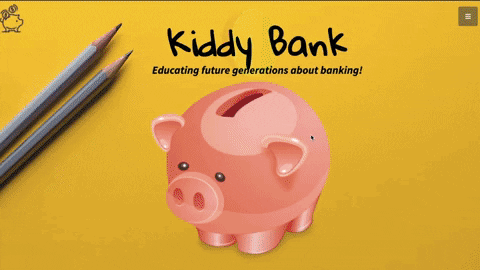

# Kiddy-Bank-ElleHacks-Winner
As part of ElleHacks our idea - "Kiddy Bank" - won the Bell Custom Award!

We won out of ten teams for the Bell Custom Award – to create a technology solution that will help those who have traditionally been less likely to benefit from technological innovation.

## Demo
- 🔗 [Live Demo](https://nareshribabu.github.io/Kiddy-Bank-ElleHacks-Winner/)
- 🔗 [Presentation](https://youtu.be/cUOvI7lmlfs)

## Description of Kiddy Bank
An interactive banking game that will focus on the critical fundamentals of financial literacy by guiding youths on making responsible financial decisions from a young age.
Our team has created a hands-on and interactive banking game called “Kiddy Bank” that exposes the children to important financial concepts. Additionally, Kiddy Bank helps facilitate important and crucial conversations about finance between parents and children.

## Features
- How to manage an Online "Kiddy" Bank
- Savings
- Investing
- Budgeting
- Spending
- Loans
- Interest

## Tech Stack:
- Bootstrap
- Google slides
- Viual studio code
- HTML
- CSS
- Javascript
- Youtube

